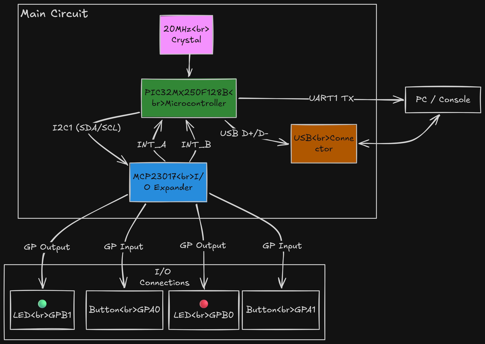
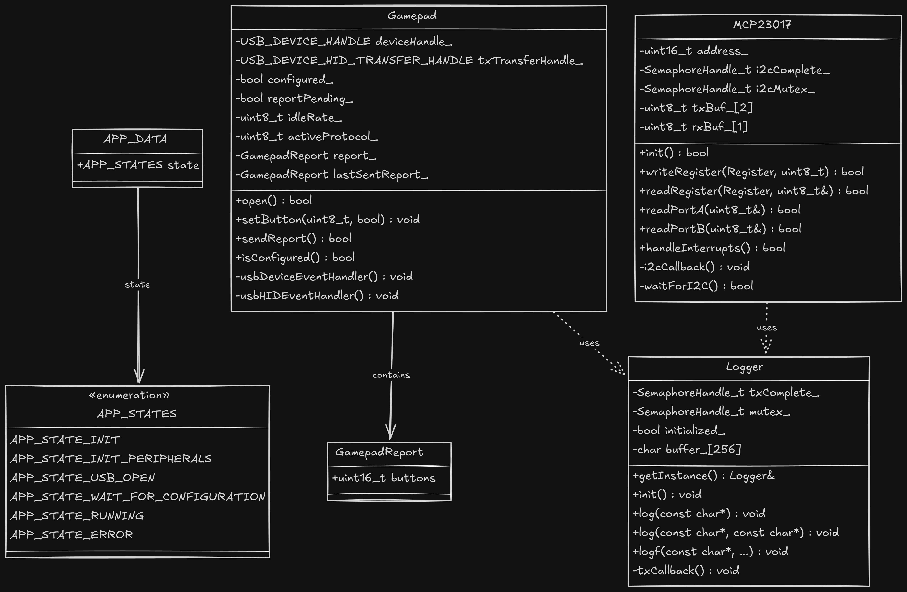
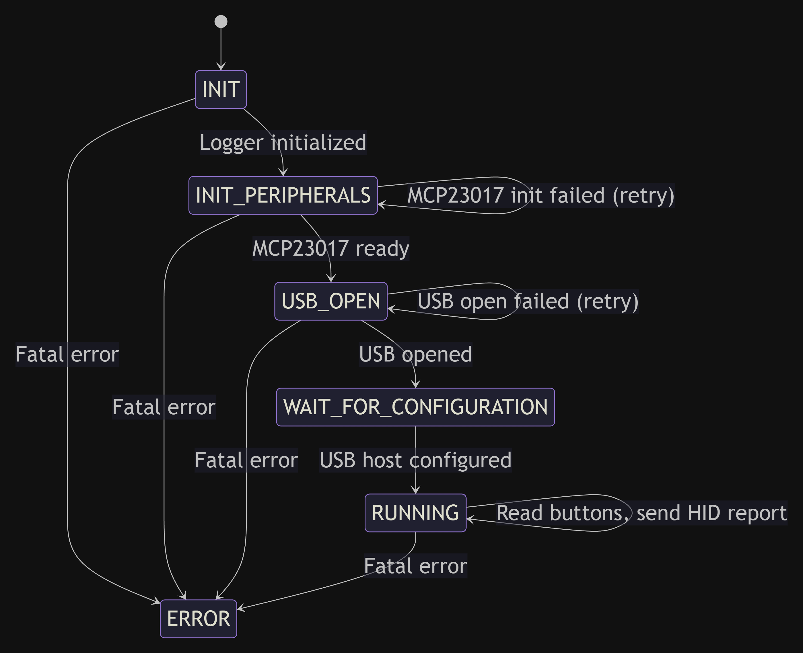

# USB Controller 32

A USB HID gamepad controller built on the **PIC32MX250F128B** microcontroller. The firmware reads button inputs from GPIO pins and an **MCP23017** I2C I/O expander, then reports them to a host PC as a standard USB HID gamepad. Built with **MPLAB Harmony 3**, **FreeRTOS**, and **C++**.



## Features

- USB HID gamepad with up to 18 button inputs (2 direct GPIO + 16 via MCP23017)
- MCP23017 I2C I/O expander with interrupt-driven input detection
- FreeRTOS-based task scheduling
- UART debug logging
- Green and red status LEDs

## Architecture


### UML Class Diagram



### State Machine



## Pin Assignment Table

### PIC32MX250F128B Direct I/O

| Signal | Pin | Port | Direction | Description |
|---|---|---|---|---|
| GREEN_LED | 4 | RB0 | Output | Green status LED |
| RED_LED | 5 | RB1 | Output | Red status LED |
| INTERRUPT_A | 14 | RB5 | Input | MCP23017 Port A interrupt (active-low) |
| INTERRUPT_B | 16 | RB7 | Input | MCP23017 Port B interrupt (active-low) |
| BUTTON_1 | 25 | RB14 | Input | Direct button input 1 |
| BUTTON_2 | 26 | RB15 | Input | Direct button input 2 |
| SDA1 | 18 | RB9 | Bidirectional | I2C1 data to MCP23017 |
| SCL1 | 17 | RB8 | Output | I2C1 clock to MCP23017 |
| U1RX | 6 | RB2 | Input | UART1 receive (debug) |
| U1TX | 11 | RB4 | Output | UART1 transmit (debug) |
| D+ | 15 | — | Bidirectional | USB data plus |
| D− | 16 | — | Bidirectional | USB data minus |
| VUSB3V3 | 14 | — | Power | USB 3.3V supply |

### MCP23017 I/O Expander (I2C address 0x20)

| Port | Pins | Direction | Pull-ups | Interrupt | Description |
|---|---|---|---|---|---|
| Port A | GPA0–GPA7 | Input | Enabled | Enabled (interrupt-on-change) | 8 button inputs |
| Port B | GPB0–GPB7 | Input | Enabled | Enabled (interrupt-on-change) | 8 button inputs |

### Input/Output Summary

| Type | Count | Source | Details |
|---|---|---|---|
| Button inputs (direct) | 2 | PIC32 GPIO | RB14, RB15 |
| Button inputs (expanded) | 16 | MCP23017 Port A & B | GPA0–7, GPB0–7 |
| LED outputs | 2 | PIC32 GPIO | Green (RB0), Red (RB1) |
| USB HID | 1 | USB peripheral | 16-bit button report |
| Debug UART | 1 | UART1 | 115200 baud (TX: RB4, RX: RB2) |
| I2C bus | 1 | I2C1 | MCP23017 at 0x20 |

## Getting Started

### Prerequisites

- [MPLAB X IDE](https://www.microchip.com/mplab/mplab-x-ide) or the **MPLAB Extension for VS Code**
- [XC32 Compiler](https://www.microchip.com/xc32) (v4.x or later)
- [PIC32MX DFP](https://packs.download.microchip.com/) v1.6.369
- **PICkit 5** (or compatible Microchip programmer/debugger)
- Git

### Install MPLAB for VS Code

1. Open **VS Code** (or VS Code Insiders).
2. Go to the **Extensions** view (`Ctrl+Shift+X`).
3. Search for **"MPLAB"** and install the **Microchip MPLAB** extension pack.
4. The extension will prompt you to install the **XC32 compiler** and required device packs if they are not found. Follow the prompts.
5. Restart VS Code after installation.


### Clone and Build

```bash
git clone https://github.com/jcksnvllxr80/usb-controller-32.git
cd usb-controller-32
```

1. Open the folder in VS Code.
2. The MPLAB extension should detect the project automatically via the CMake configuration in the `cmake/` directory.
3. Select the **usb-controller-32** project and the **default** configuration from the MPLAB project view.
4. Click **Build** (or press `Ctrl+Shift+B`).

### Program the Device

1. Connect the **PICkit 5** to the ICSP header on your board (ensure correct pin 1 orientation).
2. In the MPLAB extension, select **PICkit 5** as the hardware tool.
3. Set the programming speed to **Low** if you encounter connection issues.
4. Click **Program** to flash the `.hex` file to the PIC32MX250F128B.

### Verify Operation

1. After programming, the device should enumerate as a USB HID gamepad on the host PC.
2. Open **Set up USB game controllers** (Windows) or a gamepad tester to confirm button presses are registered.
3. Connect a serial terminal (115200 baud, 8N1) to the UART TX pin (RB4) to view debug logs.

## Project Structure

```
usb-controller-32/
├── cmake/                      # CMake build configurations
├── docs/                       # Datasheets, block diagram, images
├── usb-controller-32/
│   ├── mcc/                    # MPLAB Code Configurator files
│   └── src/
│       ├── main.cpp            # Entry point (SYS_Initialize + SYS_Tasks)
│       ├── app.cpp / app.h     # Application state machine
│       ├── gamepad.cpp / .h    # USB HID gamepad driver
│       ├── mcp23017.cpp / .h   # MCP23017 I2C I/O expander driver
│       ├── logger.cpp / .h     # UART debug logger (singleton)
│       ├── config/             # Harmony-generated peripheral config
│       └── third_party/rtos/   # FreeRTOS source
└── README.md
```

## License

See Microchip's license terms in the source file headers.

